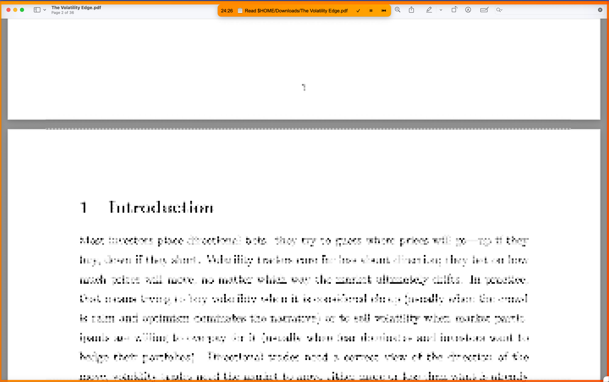

# Focused Reminder

A focused reminder application with visual borders and countdown timer that displays Apple Reminders data.



## Installation and Running

### Prerequisites

- Python 3.9 or higher
- macOS (required for Apple Reminders integration)

### Installation

```bash
# Clone the repository
git clone https://github.com/namuan/focused-reminder.git
cd focused-reminder

# Install dependencies using uv
make install
```

### Running the Application

```bash
# Run the application directly
make run

# Or run using uv
uv run focused-reminder
```

## Development

### Setting up the Development Environment

```bash
# Install dependencies and pre-commit hooks
make install

# Run code quality checks
make check
```

### Building the Application

```bash
# Build a standalone executable
make build

# Package as macOS application
make package

# Install the macOS application to Applications folder
make install-macosx
```

## License

This project is licensed under the MIT License - see the [LICENSE](LICENSE) file for details.
