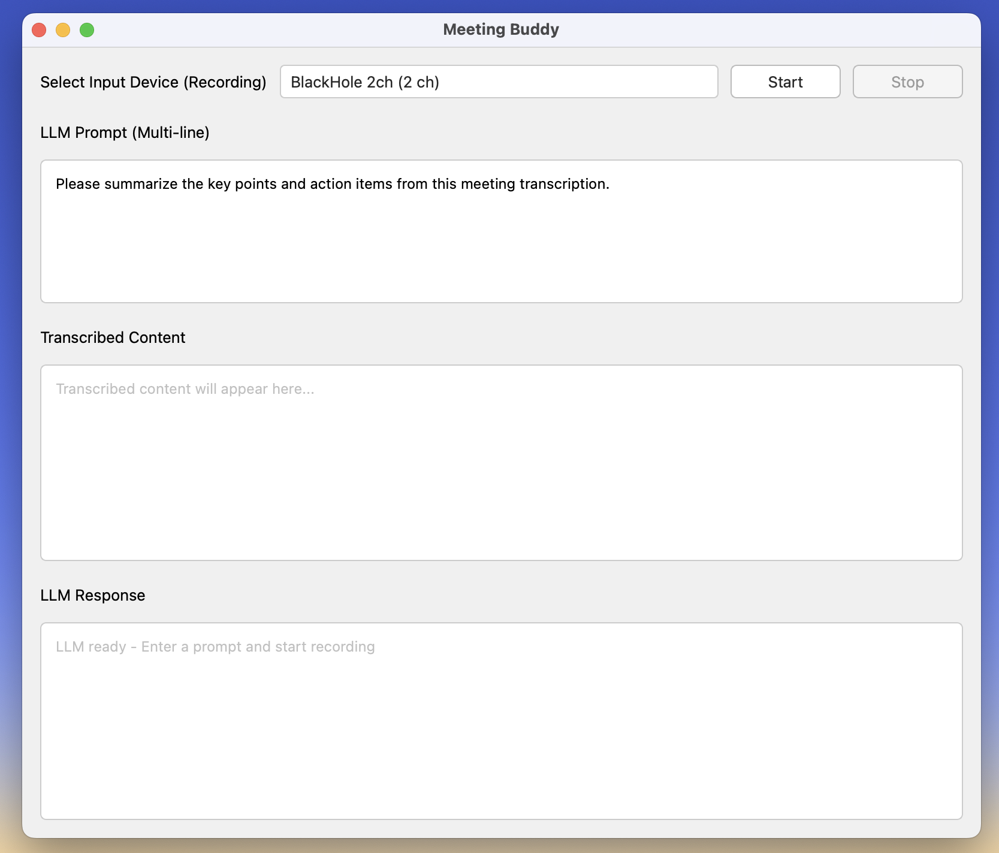
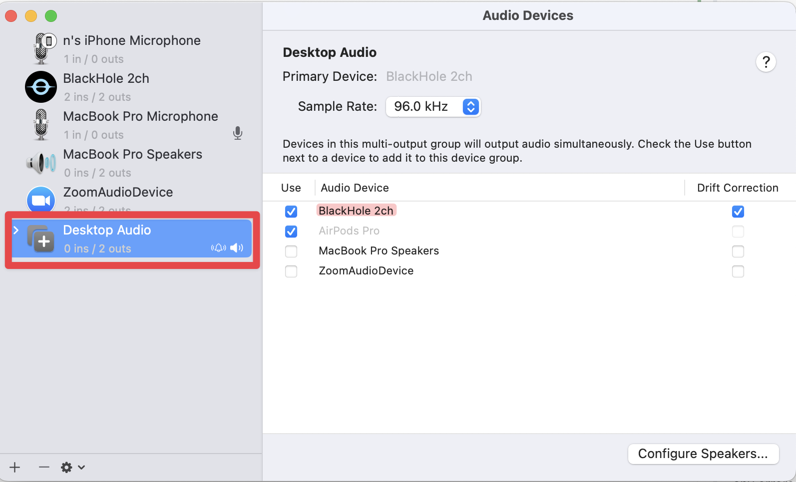
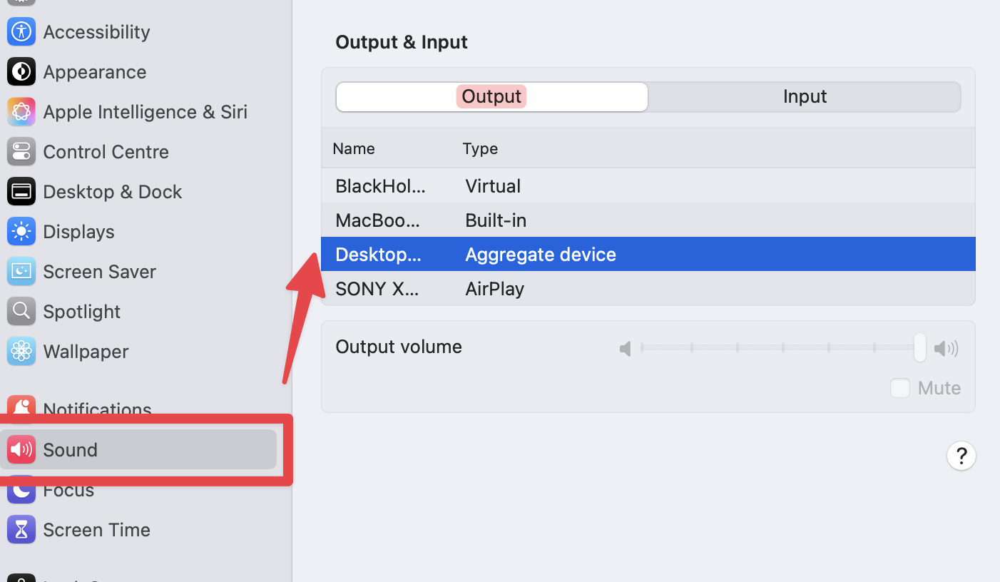

# Meeting Buddy 🎤

A real-time audio recording and transcription application with AI-powered analysis capabilities. Meeting Buddy helps you capture, transcribe, and analyze meetings or conversations using OpenAI Whisper for speech-to-text and local LLM integration via Ollama.



## Features

- **Real-time Audio Recording**: Capture audio from any input device
- **Live Transcription**: Convert speech to text using OpenAI Whisper
- **AI Analysis**: Process transcriptions with local LLMs via Ollama

## Requirements

- Python 3.10 (specifically, not 3.11+)
- PyQt6 for the GUI
- PyAudio for audio recording
- OpenAI Whisper for transcription
- Ollama (optional, for LLM analysis)

## Installation

### Prerequisites

1. **Install Python 3.10**: Make sure you have Python 3.10 installed (not 3.11+)
2. **Install Ollama** (optional): For LLM analysis features

   ```bash
   # macOS
   brew install ollama

   # Or download from https://ollama.ai
   ```

### Quick Start

1. **Clone the repository**:

   ```bash
   git clone https://github.com/namuan/meeting-buddy.git
   cd meeting-buddy
   ```

2. **Install dependencies**:

   ```bash
   make install
   ```

3. **Run the application**:
   ```bash
   make run
   ```

## Usage

### Basic Usage

1. **Launch the application**:

   ```bash
   make run
   ```

2. **Select Audio Input**: Choose your preferred audio input device from the dropdown

3. **Start Recording**: Click the "Start Recording" button to begin capturing audio

4. **View Transcription**: Watch as your speech is transcribed in real-time

5. **AI Analysis** (optional): If you have Ollama running, enter a prompt to analyze the transcription

6. **Stop Recording**: Click "Stop Recording" when finished

### Audio Setup (macOS)

For optimal audio capture on macOS:

1. Open **Audio MIDI Setup** (Applications > Utilities)
2. Configure your audio devices as shown:



3. Set the correct sound output device:



## Configuration

### LLM Integration

To use LLM analysis features:

1. **Install Ollama**: Follow the installation instructions above
2. **Start Ollama**:
   ```bash
   ollama serve
   ```
3. **Pull a model** (e.g., llama3.2):
   ```bash
   ollama pull llama3.2
   ```
4. **Configure in app**: The application will automatically detect running Ollama instances

## Troubleshooting

### Common Issues

1. **No audio devices detected**:

   - Check that your microphone is connected and recognized by the system
   - Try running with verbose logging: `make run -v`

2. **Transcription not working**:

   - Ensure OpenAI Whisper is properly installed
   - Check audio input levels
   - Verify the selected audio device is working

3. **LLM analysis not available**:

   - Make sure Ollama is installed and running
   - Verify you have pulled at least one model
   - Check Ollama is accessible at the default port (11434)

4. **Application won't start**:
   - Ensure you're using Python 3.10 (not 3.11+)
   - Try reinstalling dependencies: `make install`
   - Check the logs for specific error messages

### Logging

For debugging issues, run with increased verbosity:

```bash
# Info level logging
make run -v

# Debug level logging
make run -vv
```

Logs will help identify issues with audio devices, transcription, or LLM connectivity.

## License

This project is licensed under the MIT License - see the [LICENSE](LICENSE) file for details.
